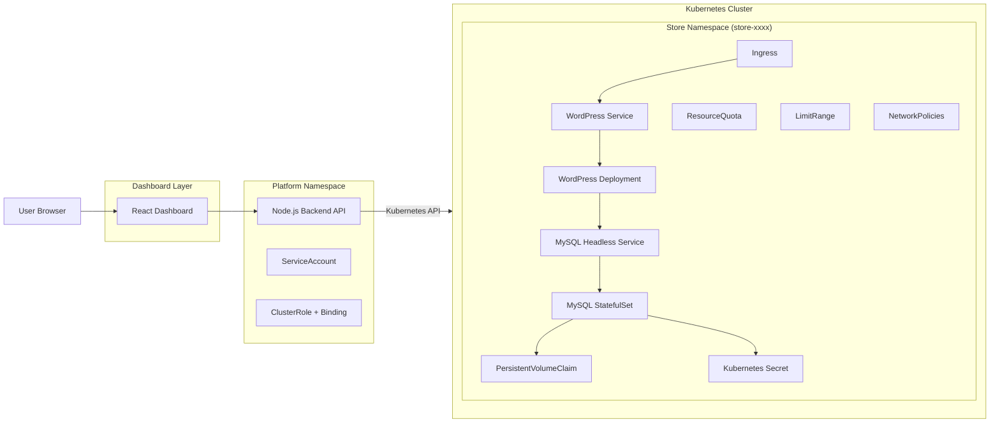
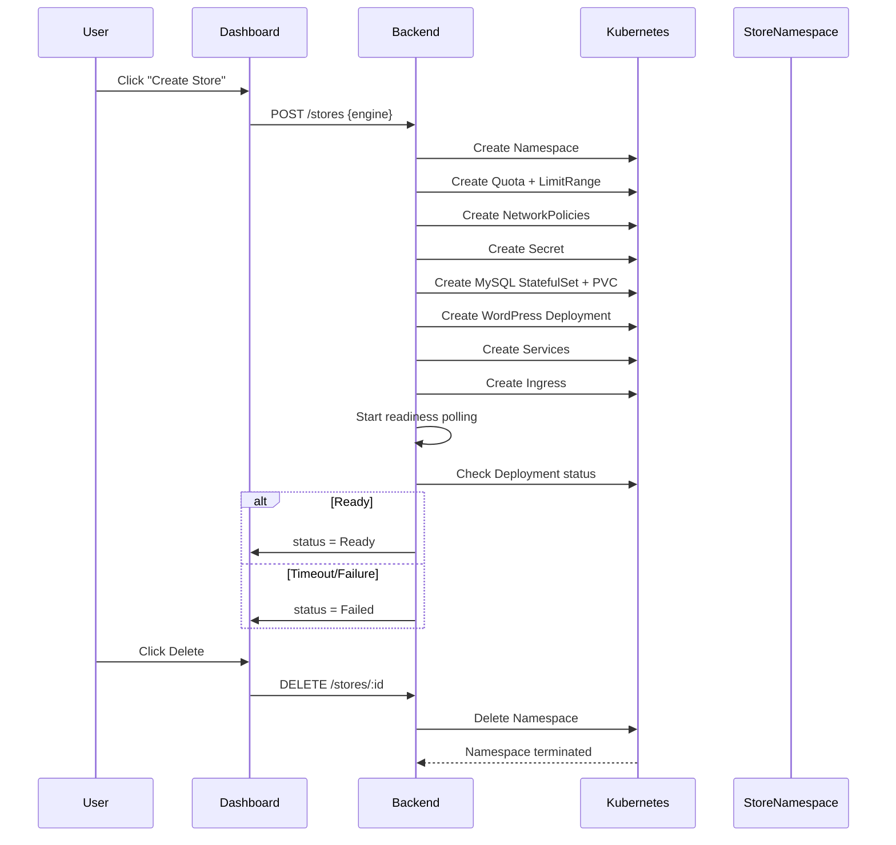
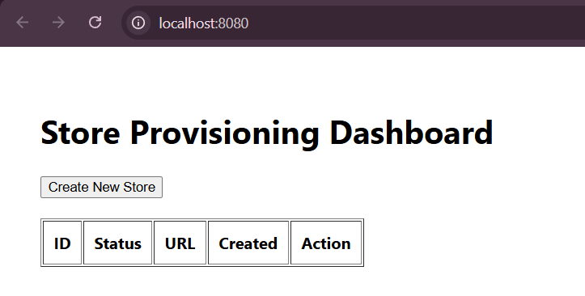

# Kubernetes Store Provisioning Platform (Local → Production)

This project implements a multi-tenant ecommerce store provisioning platform running on Kubernetes.

Users can:
- Create WooCommerce stores dynamically
- View provisioning status
- Access stores via Ingress URLs
- Delete stores with full cleanup
- Run the same Helm charts locally (k3d) and in production (k3s)

---

# Architecture Overview

Components:

- React Dashboard (UI)
- Node.js Backend (Provisioning API)
- Kubernetes cluster (k3d locally / k3s for VPS)
- Namespace-per-store isolation
- MySQL (StatefulSet)
- WordPress + WooCommerce (Deployment)
- Traefik Ingress
- Helm for deployment

Each store gets:
- Dedicated namespace
- Dedicated DB
- Dedicated PVC
- ResourceQuota + LimitRange
- NetworkPolicies
- Unique Ingress host

---

# Local Setup (k3d)

## 1. Create cluster

```bash
k3d cluster create store-cluster --agents 2
````

## 2. Install platform via Helm

```bash
kubectl create namespace platform
helm install platform ./helm/platform -n platform -f values-local.yaml
```

## 3. Build backend image

```bash
cd backend
docker build -t store-platform-backend:1.0 .
k3d image import store-platform-backend:1.0 -c store-cluster
kubectl rollout restart deployment platform-backend -n platform
```

## 4. Access Dashboard

```
http://localhost:8080
```

---

# Creating a Store

```
POST /stores
```

The system:

1. Creates namespace
2. Applies ResourceQuota & LimitRange
3. Applies NetworkPolicies
4. Creates MySQL StatefulSet
5. Creates WordPress Deployment
6. Creates Services
7. Creates Ingress
8. Waits for readiness
9. Updates status to Ready

---

# Testing WooCommerce End-to-End

1. Open:

```
http://store-<id>.localhost
```

2. Complete WordPress setup
3. Install WooCommerce plugin
4. Add product
5. Add to cart
6. Checkout (COD)
7. Verify order in Admin panel

This satisfies the Definition of Done.

---

# Delete Store

```
DELETE /stores/:id
```

This deletes the namespace and all resources inside it.

---

# Production Deployment (k3s)

Same Helm chart.

```
helm install platform ./helm/platform -n platform -f values-prod.yaml
```

Changes via values:

* Domain
* StorageClass
* TLS settings

No code changes required.

---

# Security Features

* Dedicated ServiceAccount
* Least-privilege ClusterRole
* No cluster-admin usage
* Namespace isolation
* Default deny NetworkPolicy
* ResourceQuota & LimitRange
* Non-root container execution
* Secrets stored in Kubernetes Secret

---

# Scaling Strategy

* Backend can scale horizontally
* Stores isolated per namespace
* Provisioning controlled via rate limiting
* Cluster nodes can scale independently

---

# Metrics & Observability

```
GET /metrics
GET /activity
```

Tracks:

* Total stores
* Failed provisioning
* Ready stores
* Audit events

---

# Medusa Support

Architecture supports pluggable engine abstraction.
WooCommerce fully implemented.
Medusa path stubbed and can be extended without architecture change.

---

# Tradeoffs

* In-memory store state (for Round 1 simplicity)
* No external DB for control-plane state
* Basic rate limiting (IP-based)
* No persistent audit store

These can be extended in production.

## One-Command Local Setup

```bash
./scripts/local_setup.sh
```

This script:
- Creates k3d cluster
- Installs Helm chart
- Builds backend image
- Imports image
- Restarts deployment

---
# Architecture Diagram



## Architecture Explanation

* The **React Dashboard** interacts with the backend API.

* The **Node.js backend** acts as a Kubernetes-native orchestrator.

* Each store is provisioned in its **own namespace**.

* The backend creates:

  * Namespace
  * ResourceQuota & LimitRange
  * NetworkPolicies
  * Secret
  * MySQL StatefulSet + PVC
  * WordPress Deployment
  * Services
  * Ingress

* Ingress exposes each store at:

  ```
  http://store-<id>.localhost
  ```

* Deleting a store deletes the namespace → guarantees cleanup.

---
## Store Provisioning Flow



# Dashboard
